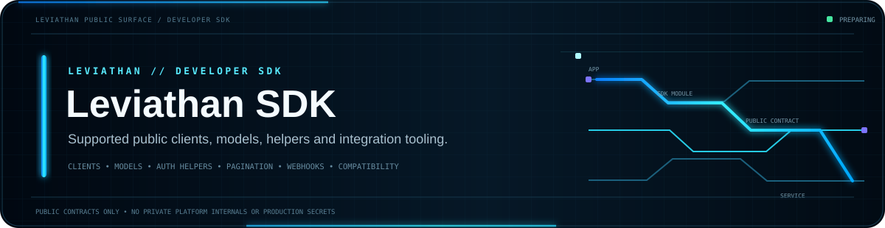
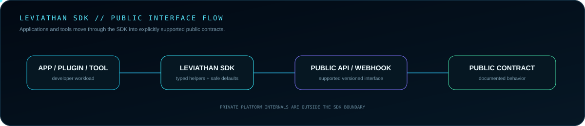
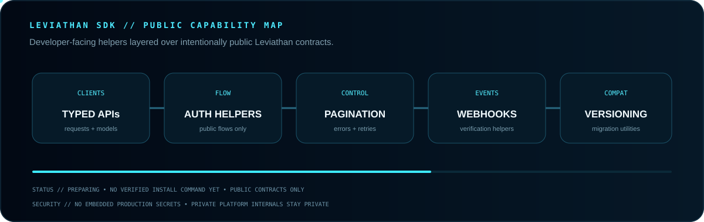

 

**Developer interfaces for supported Leviathan APIs, integrations, tools and services.**

[Guide](GUIDE.md) · [API Docs](https://github.com/Lapinite/Leviathan-API-Docs) · [Examples](https://github.com/Lapinite/Leviathan-Examples) · [Integrations](https://github.com/Lapinite/Leviathan-Integrations) · [Security](SECURITY.md)

## SDK architecture

## Capability map

## Public boundary

The SDK exposes documented public contracts only. Third-party authentication, entitlement, permission and security requirements remain intact.

No production credentials, client secrets, tokens, private keys, signing material, database credentials, personal information or private endpoints belong in this repository.

## Developer network

[Public Guide](GUIDE.md) · [API Docs](https://github.com/Lapinite/Leviathan-API-Docs) · [Examples](https://github.com/Lapinite/Leviathan-Examples) · [Integrations](https://github.com/Lapinite/Leviathan-Integrations) · [Docs](https://github.com/Lapinite/Leviathan-Docs)

Compatibility and versioning information will be published as interfaces stabilize and implementations become available.

## License

Apache License 2.0. See [LICENSE](LICENSE).
